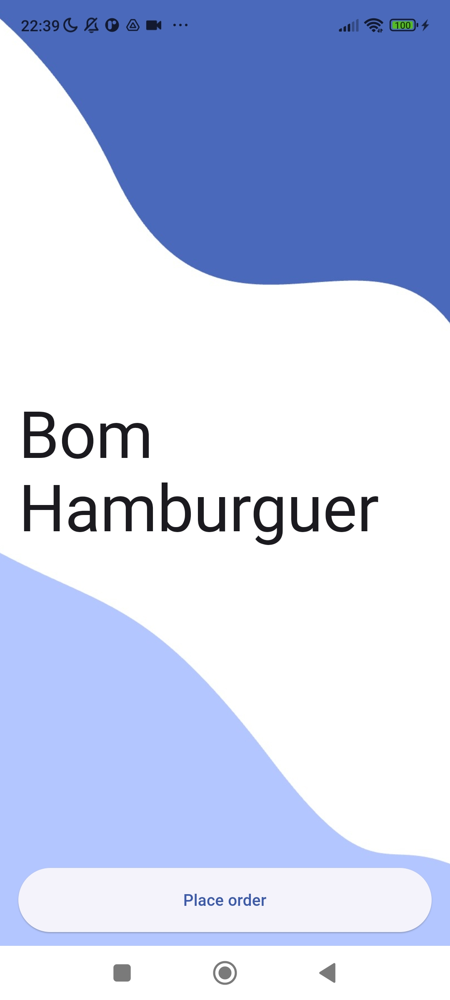
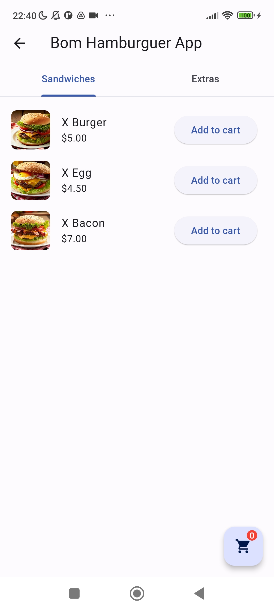
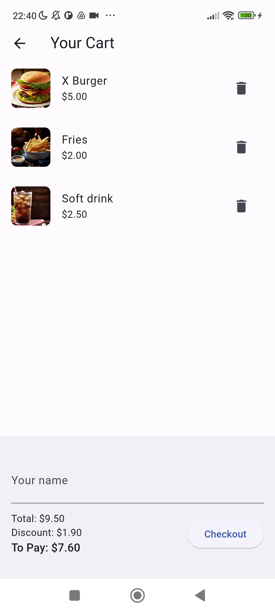
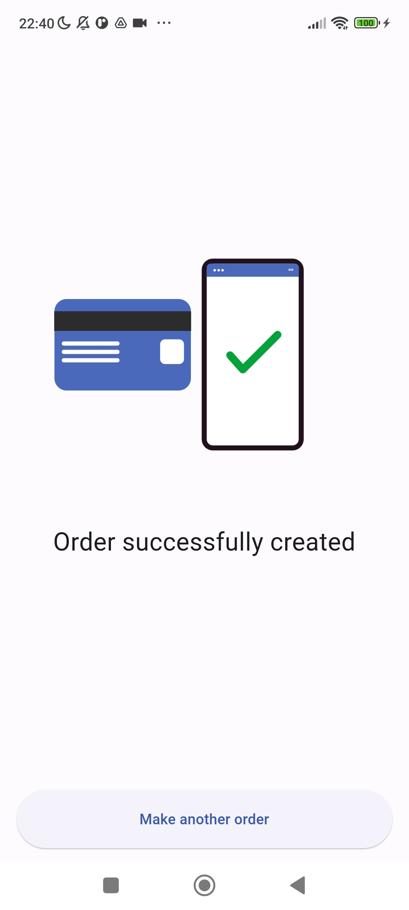

# Bom Hamburguer App

The Bom Hamburguer App is a hamburger ordering app for Android created in Flutter. Users can choose from three sandwich options and add extras. Depending on the combinations of the selected products, certain discounts are applied.
[Release APK](https://drive.google.com/file/d/1lBLpN6jm3w7HJ-yuwmro0R2CxuIPcDLD/view?usp=share_link)
## Features

1. List all sandwiches and extras.
2. Add a sandwich to the cart.
3. Show the cart with all items selected by the user and display how much they need to pay.
4. Make a payment (fake payment, doesn’t need to enter any source of payment) and create an order. Only requires the customer's name.

## Business Rules

- If the customer selects a sandwich, fries, and a drink, then the customer will have a 20% discount.
- If the customer selects a sandwich and a drink, then the customer will have a 15% discount.
- If the customer selects a sandwich and fries, then the customer will have a 10% discount.
- Each order cannot contain more than one sandwich, fries, or soda. If two identical items are sent, the APP should return an error message displaying the reason.

## Usage

1. Upon launching the app, a list of sandwiches and extras will be displayed. You can select the product you want to add to the cart.

2. Once you have selected the products, you can go to the cart by pressing the shopping cart button on the bottom right corner.

3. On the cart page, you can see all the products you have selected, as well as the total price with the discounts applied.

4. You can proceed to payment by entering your name in the provided field and pressing the 'Checkout' button.

5. After payment, a confirmation screen will be displayed. From here, you can make another order by pressing the 'Make another order' button.

## Screenshots

[video](https://github.com/dasafodev/bom_hamburguer/readme/demo.mp4)

